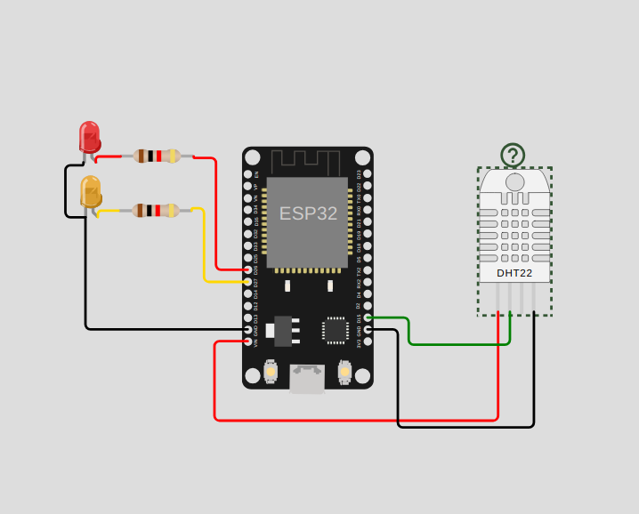

# Final Proyek Mikrokontroller
<ul>
  <li>Mata Kuliah: Sistem Mikrokontroller</li>
  <li>Dosen Pengampu: <a href="https://github.com/Muhammad-Ikhwan-Fathulloh">Muhammad Ikhwan Fathulloh</a></li>
</ul>

## Kelompok
<ul>
  <li>Kelompok: 12</li>
  <li>Proyek: Smarthome</li>
  <li>Anggota: </li>
  <ul>
    <li>Anggota 1: <a href="">Luqman</a></li>
    <li>Anggota 2: <a href="">Ages</a></li>
    <li>Anggota 3: <a href="">Agus</a></li>
  </ul>
</ul>

## Judul Proyek
<p>Smarthome dengan Platform Blynk, RESTful API dan MQTT</p>

## Pembagian Tim
<p>Anggota 1 : Smarthome dengan Platform Blynk</p>
<p>Anggota 2 : Smarthome dengan RESTful API</p>
<p>Anggota 3 : Smarthome dengan MQTT</p>

## Anggota 1 : Proyek Smarthome dengan Platform Blynk
### Penjelasan Proyek
### Demo Proyek Smarthome dengan MQTT
<ul>
  <li>Github: <a href="">Github</a></li>
  <li>Youtube: <a href="">Youtube</a></li>
</ul>

## Anggota 2 : Proyek Smarthome dengan RESTful API



### Penjelasan Proyek
#### Spesifikasi

  1. **Mock API sebagai RESTful API:**
     - Gunakan layanan mock API (seperti jsonplaceholder atau mockapi.io) untuk membuat endpoint API palsu.
  2. **Tampilan Website dengan HTML, CSS, dan JS:**
     - Buat halaman web yang menggunakan HTML, CSS, dan JS untuk berinteraksi dengan API.
     - Buat tampilan untuk mengendalikan relay dan menampilkan data sensor.
  3. **Relay 2 Channel untuk Menyalakan LED:**
     - Hubungkan relay 2 channel ke mikrokontroller.
     - Buat skema rangkaian untuk menghubungkan relay ke LED.
  4. **Sensor Bebas:**
     - Pilih sensor lain untuk digunakan (misalnya, sensor jarak atau sensor cahaya).
     - Hubungkan sensor tersebut ke mikrokontroller dan baca datanya.

#### 1. Mock API sebagai RESTful API

**Langkah-langkah:**

1. **Daftar di Mock API Service:**
   - Pergi ke [mockapi.io](https://mockapi.io) dan buat akun jika belum memiliki.
   - Buat proyek baru dan tambahkan resource untuk `relays` dan `sensors`.

2. **Buat Endpoint API:**
   - Tambahkan data dummy untuk `relays` dan `sensors`.
   - Endpoint contoh:
     - `GET /relays` untuk mendapatkan daftar relay.
     - `POST /relays` untuk menambah atau mengubah status relay.
     - `GET /sensors` untuk mendapatkan data sensor.
     - `POST /sensors` untuk menambah atau mengubah data sensor.

#### 2. Tampilan Website dengan HTML, CSS, dan JS

**HTML:/smarthome-restapi/index.html**

```html
<!DOCTYPE html>
<html lang="en">
<head>
    <meta charset="UTF-8">
    <meta name="viewport" content="width=device-width, initial-scale=1.0">
    <title>Smarthome Dashboard</title>
    <link rel="stylesheet" href="/smarthome-restapi/styles.css">
</head>
<body>
    <div id="app">
        <h1>Smarthome Dashboard</h1>
        <div id="relay-control">
            <h2>Relay Control</h2>
            <button onclick="toggleRelay(1)">Toggle Relay 1</button>
            <button onclick="toggleRelay(2)">Toggle Relay 2</button>
        </div>
        <div id="sensor-data">
            <h2>Sensor Data</h2>
            <ul id="sensor-list"></ul>
        </div>
    </div>
    <script src="/smarthome-restapi/scripts.js"></script>
</body>
</html>
```

**CSS:/smarthome-restapi/style.css**
```
css
body {
    font-family: Arial, sans-serif;
}
#app {
    width: 600px;
    margin: 0 auto;
}
h1, h2 {
    text-align: center;
}
#relay-control, #sensor-data {
    margin: 20px 0;
}
```

**JS:/smarthome-restapi/script.js**
```
const API_URL = 'https://66a481c45dc27a3c19090f94.mockapi.io';

document.addEventListener('DOMContentLoaded', () => {
    fetchSensorData();
});

function toggleRelay(relayId) {
    fetch(`${API_URL}/relays/${relayId}`, {
        method: 'POST',
        headers: {
            'Content-Type': 'application/json'
        },
        body: JSON.stringify({ state: 'toggle' })
    })
    .then(response => response.json())
    .then(data => {
        console.log(`Relay ${relayId} toggled`, data);
    })
    .catch(error => console.error('Error:', error));
}

function fetchSensorData() {
    fetch(`${API_URL}/sensors`)
    .then(response => response.json())
    .then(data => {
        const sensorList = document.getElementById('sensor-list');
        sensorList.innerHTML = '';
        data.forEach(sensor => {
            const li = document.createElement('li');
            li.textContent = `Sensor ${sensor.id}: ${sensor.value}`;
            sensorList.appendChild(li);
        });
    })
    .catch(error => console.error('Error:', error));
}

```
**Arduino : Wowki https://wokwi.com/projects/404543147358835713**
```
arduino
#define BLYNK_TEMPLATE_ID "TMPL6V8BMAwlT"
#define BLYNK_TEMPLATE_NAME "BelajarBlynk"
#define BLYNK_AUTH_TOKEN "le4Ti3_UcNgSpeL3gMVVs_qdIIuHoDHo"
#define BLYNK_PRINT Serial

#include <WiFi.h>
#include <BlynkSimpleEsp32.h>
#include <DHTesp.h> // Library untuk DHT
#include <HTTPClient.h>
#include <ArduinoJson.h>

char auth[] = BLYNK_AUTH_TOKEN; // Auth Token

char ssid[] = "Wokwi-GUEST"; // Nama hotspot yang digunakan
char pass[] = ""; // Password hotspot yang digunakan

const int DHT_PIN = 15;

int value0, value1;

byte LED_R = 26;
byte LED_Y = 27;

DHTesp dht;

BlynkTimer timer;

// URL Mock API
const char* mockApiUrl = "https://66a481c45dc27a3c19090f94.mockapi.io";

// Function untuk pengiriman sensor
void sendSensor()
{
  TempAndHumidity data = dht.getTempAndHumidity();

  // Menampilkan temperature pada Serial monitor
  Serial.print("% Temperature: ");
  Serial.print(data.temperature);
  Serial.println("C ");
  Serial.print("% Kelembaban: ");
  Serial.print(data.humidity);
  Serial.println("% ");

  Blynk.virtualWrite(V2, data.temperature); // Mengirimkan data temperatur ke Virtual pin V2 di Blynk Cloud
  Blynk.virtualWrite(V3, data.humidity); // Mengirimkan data kelembaban ke Virtual pin V3 di Blynk Cloud

  // Mengirim data ke mock API
  if(WiFi.status() == WL_CONNECTED) {
    HTTPClient http;
    http.begin(mockApiUrl);
    http.addHeader("Content-Type", "application/json");

    StaticJsonDocument<200> jsonDoc;
    jsonDoc["temperature"] = data.temperature;
    jsonDoc["humidity"] = data.humidity;

    String requestBody;
    serializeJson(jsonDoc, requestBody);

    int httpResponseCode = http.POST(requestBody);

    if (httpResponseCode > 0) {
      String response = http.getString();
      Serial.println(httpResponseCode);
      Serial.println(response);
    } else {
      Serial.print("Error on sending POST: ");
      Serial.println(httpResponseCode);
    }
    http.end();
  }
}

BLYNK_WRITE(V0)
{
  value0 = param.asInt();
  digitalWrite(LED_R, value0);
}

BLYNK_WRITE(V1)
{
  value1 = param.asInt();
  digitalWrite(LED_Y, value1);
}

void setup()
{
  // Debug console
  Serial.begin(115200);
  dht.setup(DHT_PIN, DHTesp::DHT22);
  pinMode(LED_R, OUTPUT);
  pinMode(LED_Y, OUTPUT);
  Blynk.begin(auth, ssid, pass);
  timer.setInterval(1000, sendSensor);
}

void loop()
{
  Blynk.run();
  timer.run();
}
```

### Demo Proyek Smarthome dengan RESTful API
<ul>
  <li>Github: <a href="https://github.com/ages96/sistem-mikrokontroller/tree/master/smarthome-restapi">Github</a></li>
  <li>Youtube: <a href="https://www.youtube.com/watch?v=HumQUj3Oky8">Youtube</a></li>
</ul>

## Anggota 3 : Proyek Smarthome dengan MQTT
### Penjelasan Proyek
### Spesifikasi 

**1. EMQX sebagai MQTT Broker**
    -Instal dan konfigurasikan EMQX sebagai broker MQTT.
    
**2. Tampilan Website dengan HTML, CSS, dan JS:**
    -Buat halaman web yang menggunakan HTML, CSS, dan JS untuk berinteraksi dengan brokerMQTT.
    -Buat tampilan untuk mengendalikan relay dan menampilkan data sensor.
    
**3. Relay 2 Channel untuk Menyalakan LED:**
    -Hubungkan relay 2 channel ke mikrokontroller.
    -Buat skema rangkaian untuk menghubungkan relay ke LED.
    
**4. Sensor Bebas:**
    -Pilih sensor lain untuk digunakan (misalnya, sensor jarak atau sensor cahaya).
    -Hubungkan sensor tersebut ke mikrokontroller dan baca datanya.
    
#### 1. 1. EMQX sebagai MQTT Broker:

**LangkaH-langkah**

1.**Instalasi EMQX dan Konfigurasi:**
  - Unduh EMQX dari situs resmi EMQX.
  - Ikuti petunjuk instalasi yang sesuai dengan sistem operasi Anda.
    
2.**Konfigurasi EMQX:**
  - Buka file konfigurasi EMQX (emqx.conf) dan sesuaikan pengaturan seperti port dan 
    pengaturan keamanan jika diperlukan.
  - Start EMQX dengan menjalankan perintah ./emqx start atau menggunakan service manager  
    sesuai OS Anda.

### 2. Tampilan Website dengan HTML, CSS, dan JS

**<HTML:/smarthome-mqtt/index.html>**

<html>
<head>
    <title>Smart Home</title>
    <link rel="stylesheet" type="text/css" href="styles.css">
</head>
<body>
    <h1>Smart Home Control</h1>
    <button id="relay1">Relay 1</button>
    <button id="relay2">Relay 2</button>
    <div id="sensor-data"></div>
    <script src="scripts.js"></script>
</body>
</html>

**CSS:/smarthome-mqtt/style.css**

body {
    font-family: Arial, sans-serif;
    text-align: center;
    background-color: #f4f4f4;
}

button {
    margin: 10px;
    padding: 10px 20px;
    font-size: 16px;
}

#sensor-data {
    margin-top: 20px;
}

**JS:/smarthome-mqtt/script.js**

const brokerUrl = 'ws://your-mqtt-broker-url:port';
const clientId = 'clientId-' + Math.random().toString(16).substr(2, 8);
const client = new Paho.MQTT.Client(brokerUrl, clientId);

client.connect({onSuccess: onConnect});

function onConnect() {
    console.log("Connected to MQTT broker");
    client.subscribe('sensor/data');
}

document.getElementById('relay1').onclick = () => {
    client.publish('relay/control', '1');
};

document.getElementById('relay2').onclick = () => {
    client.publish('relay/control', '2');
};

client.onMessageArrived = (message) => {
    if (message.destinationName === 'sensor/data') {
        document.getElementById('sensor-data').innerHTML = 'Sensor Data: ' + message.payloadString;
    }
};

**Arduino : Wowki https://wokwi.com/projects smarthome-mqtt/**
#include <WiFi.h>
#include <MQTT.h>

const char ssid[] = "Wokwi-GUEST";
const char pass[] = "";

WiFiClient net;
MQTTClient client;

unsigned long lastMillis = 0;

int count = 0;

void connect() {
  Serial.print("checking wifi...");
  while (WiFi.status() != WL_CONNECTED) {
    Serial.print(".");
    delay(1000);
  }

  Serial.print("\nconnecting...");
  while (!client.connect("arduino", "public", "public")) {
    Serial.print(".");
    delay(1000);
  }

  Serial.println("\nconnected!");

  client.subscribe("koalawan/iot/kontak1");
  client.subscribe("koalawan/iot/kontak2");
  client.subscribe("koalawan/iot/count");
  client.subscribe("koalawan/iot/temp");
  client.subscribe("koalawan/iot/humd");
}

void messageReceived(String &topic, String &payload) {
  Serial.println(topic + ": " + payload);
  if (topic == "koalawan/iot/kontak1") {
    Serial.println("LED1 " + payload);
    digitalWrite(19, payload.toInt());
  }

  if (topic == "koalawan/iot/kontak2") {
    Serial.println("LED2 " +payload);
    digitalWrite(18, payload.toInt());
  }
}

void setup() {
  Serial.begin(115200);

  // start wifi and mqtt
  WiFi.begin(ssid, pass);
  client.begin("public.cloud.shiftr.io", net);
  client.onMessage(messageReceived);

  pinMode(19, OUTPUT);
  pinMode(18, OUTPUT);

  connect();
}

void loop() {
  client.loop();
  delay(10);

  // check if connected
  if (!client.connected()) {
    connect();
  }

  // publish a message roughly every second.
  if (millis() - lastMillis > 2000) {
    lastMillis = millis();
    client.publish("/koalawan/iot/temperature", String(count));
    client.publish("/koalawan/iot/humidity", String(count));
    count++;
  }
}

### Demo Proyek Smarthome dengan MQTT
<ul>
  <li>Github: <a href="">Github</a></li>
  <li>Youtube: <a href="">Youtube</a></li>
</ul>
